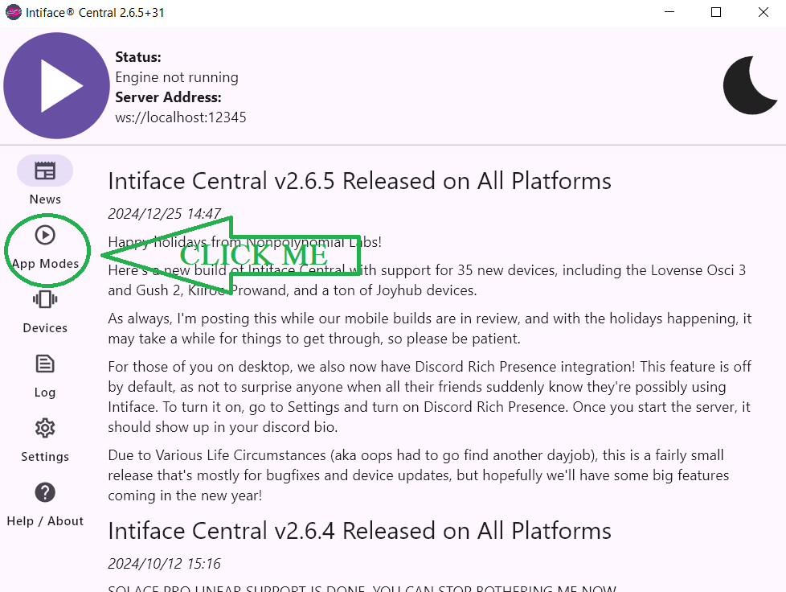
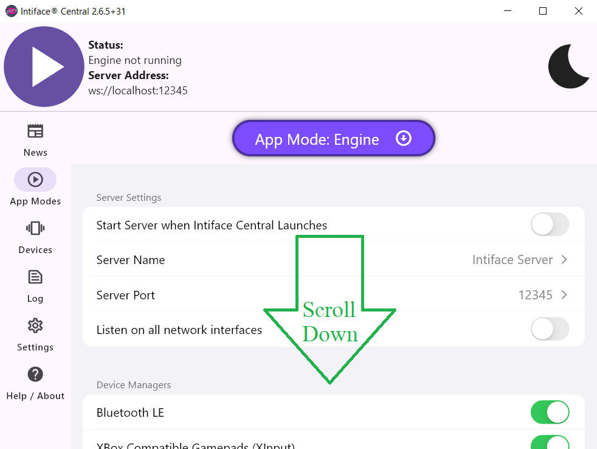
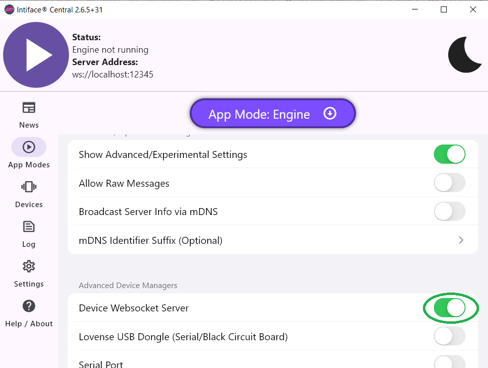
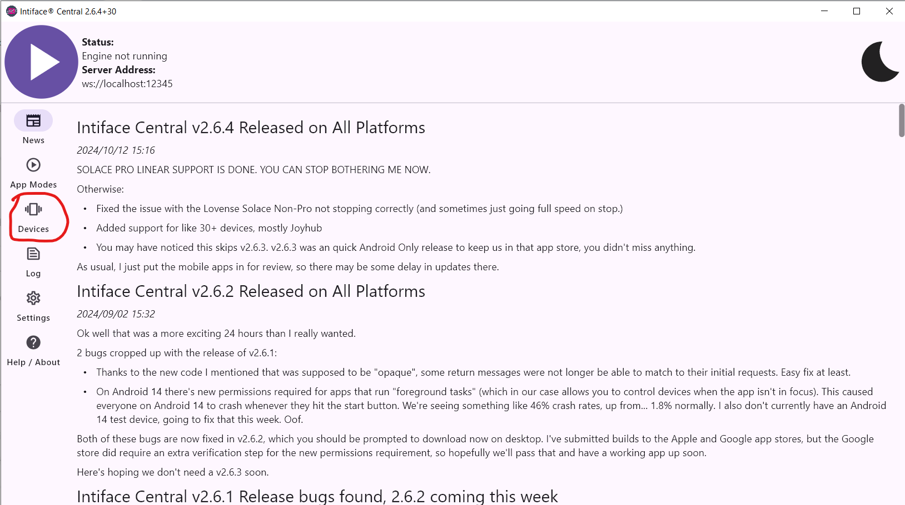
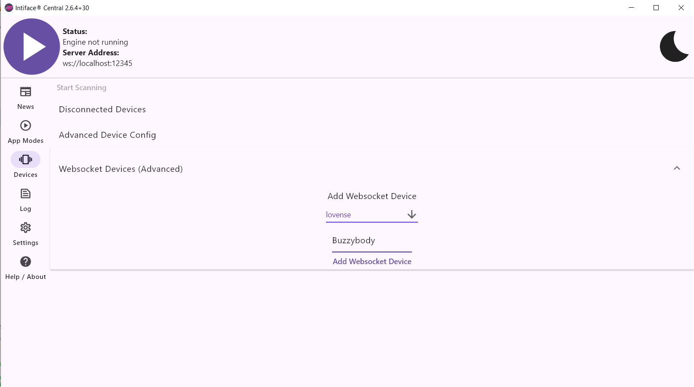
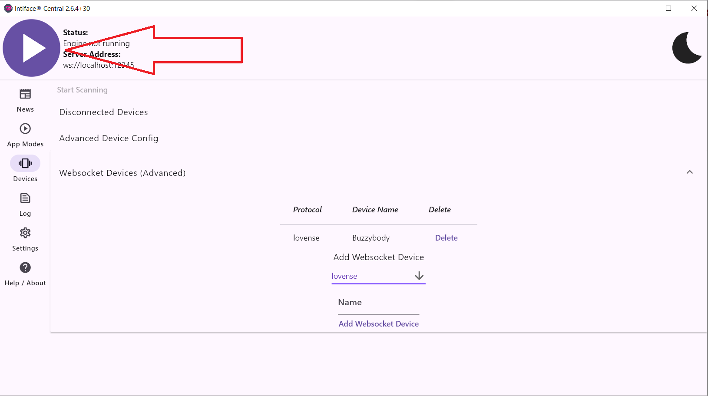
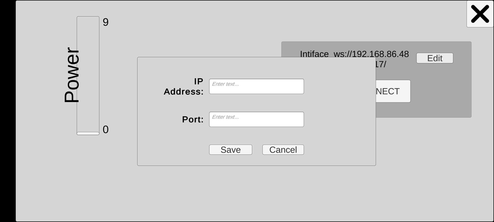
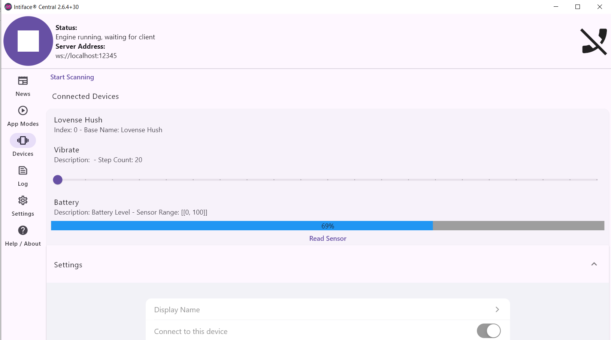

                Connect BuzzyBody to Intiface Central /\* Reset some default browser styles \*/ \* { margin: 0; padding: 0; box-sizing: border-box; } /\* Set the background and main styling \*/ body { display: flex; justify-content: center; align-items: center; min-height: 100vh; font-family: Arial, sans-serif; color: #333; background-color: #f9f9f9; } /\* Style for the container \*/ .container { text-align: center; max-width: 600px; padding: 20px; } /\* Style for the headings \*/ h1 { font-size: 2.5rem; margin-bottom: 10px; } h2 { font-size: 1.2rem; color: #555; margin-bottom: 20px; } /\* Style for lists \*/ ol { text-align: left; margin: 20px 0; padding-left: 20px; } li { margin-bottom: 15px; line-height: 1.5; } /\* Style for images \*/ .screenshot { display: block; margin: 20px auto; max-width: 100%; height: auto; border: 1px solid #ccc; padding: 5px; background-color: #fff; } /\* Style for links \*/ .links a { text-decoration: none; color: #007bff; font-size: 1.1rem; margin: 0 10px; transition: color 0.3s ease; } /\* Hover effect for links \*/ .links a:hover { color: #0056b3; } /\* Breadcrumb container \*/ .breadcrumb { position: absolute; top: 20px; left: 20px; font-size: 0.9rem; color: #555; } /\* Breadcrumb list styling \*/ .breadcrumb ul { display: flex; list-style: none; padding: 0; margin: 0; } /\* Breadcrumb item styling \*/ .breadcrumb li { margin-right: 10px; } /\* Breadcrumb separator \*/ .breadcrumb li::after { content: ">"; margin-left: 10px; color: #aaa; } /\* Remove separator from last item \*/ .breadcrumb li:last-child::after { content: ""; margin: 0; } /\* Breadcrumb link styling \*/ .breadcrumb a { text-decoration: none; color: #007bff; transition: color 0.3s ease; } .breadcrumb a:hover { color: #0056b3; }

*   [Home](/)
*   BuzzyBody
*   BuzzyBody 2 ButtPlug

Connect BuzzyBody to Intiface Central
=====================================

Follow these steps to set up your devices
-----------------------------------------

1.  Open **Intiface Central**. \[[Download Here](https://intiface.com/central/)\]
2.  First You Need to Turn on Advanced Devices
    *   Click on **App Modes** on the left side.  
        
    *   Scroll Down  
        
    *   Turn On Device Websocket Server  
        Now we can add our device.
3.  Click on **Devices** on the left side.  
    
4.  Under **Add Websocket Device**:
    
    *   Select **Lovense** from the Protocol list.
    *   Name the device **Buzzybody**.
    *   Click on **Add Websocket Device**.
    
    
5.  Click on **Start Engine**.  
    
6.  Get your IP address from the computer Intiface is running on:
    *   For Windows: Open Command Prompt and type `ipconfig`. Look for the IPv4 address.
    *   For Mac: Open System Preferences, go to Network, and find the IP under your active connection.
7.  Open **BuzzyBody** on your phone. \[[Download Here](https://comradeoohaah.itch.io/buzzybody)\]
8.  Navigate to **Proxy Functions** > **Virtual BP Device**.
9.  Click on the **Edit** button and:
    
    *   Enter your IP address in the **IP Address** text box.
    *   Enter **54817** in the **Port** text box. **DO NOT USE ANY OTHER PORT NUMBER. 54817 is the one you want.**
    
    
10.  Click **Save**, then **Connect**.
11.  Intiface should now detect your device as connected.

Troubleshooting
===============

If you run into problems, here's some things you can try.
---------------------------------------------------------

1.  If the Intiface Central Software sees the device connect, but you get an error or BuzzyBody doesn't maintain the connection.
    *   Stop the engine.
    *   Click on Forget device.
    *   Start the Engine.
    *   Attempt to Connect in BuzzyBody again.If that doesn't work, you can try repeating it, but also restart Buzzybody.
2.  If Intiface Central Software doesn't properly create a new device
    *   Exit Central Intiface
    *   Open the Intiface Central Configuration directory on desktop platforms Windows: C:\\Users\\\[UserName\]\\AppData\\Roaming\\com.nonpolynomial\\intiface\_central\\config\\ macOS: /Users/\[UserName\]/Library/ApplicationSupport/com.nonpolynomial/intiface\_central/config/
    *   Delete the buttplug-user-device-config.json **WARNING: this will delete any other emulated devices you have setup!**
    *   Open Intiface, add the device, and attempt to connect BuzzyBody.
3.  Those are the basic troubleshooting steps, messing around with a variation of restarting Intiface, re-adding the device, and restarting the BuzzyBody app will tend to get it working eventually.

Looking For Compatible Toys? [Visit Our List Here](http://comradeoohaah.com/lovespouse_toys.php)

Want More Info on Intiface's Device Emulation? [Visit WSDM Documentation](https://docs.buttplug.io/docs/dev-guide/inflating-buttplug/devices/websocket-device-manager/)
